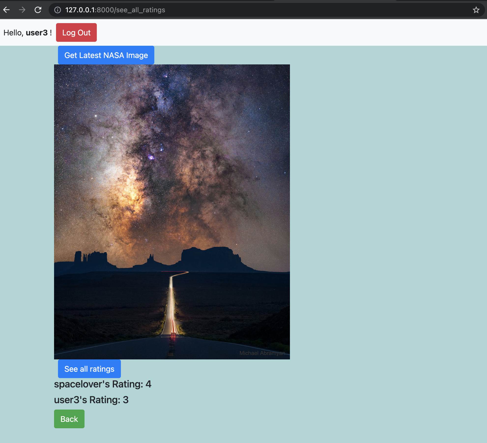

# API for Checkr
A Django project to fetch image from [NASA](https://api.nasa.gov/index.html) and provide rating to it.

## Features
* Image saved to database
* Ability to create user
* Login/Logout
* Can rate Nasa's daily image
* Can update rating
* Can view all ratings from other users

## Run locally
It is recommended that this project is run in a virtual environment. To run the project make sure you create a virtual environment and activate the environment. Once inside a virtual environment run `pip install -r requirements.txt` in the shell to install all the dependencies. 

Then navigate to the directory of the project that contains the `manage.py` file and to run locally run `python manage.py runserver` to activate the server. 

Go to `http://127.0.0.1:8000/` within the browser's address bar. 

## Screenshots

### Register a new user

### Login

### Fetch NASA daily image

### Rate NASA daily image

### Update rating for image

### View all ratings for image
